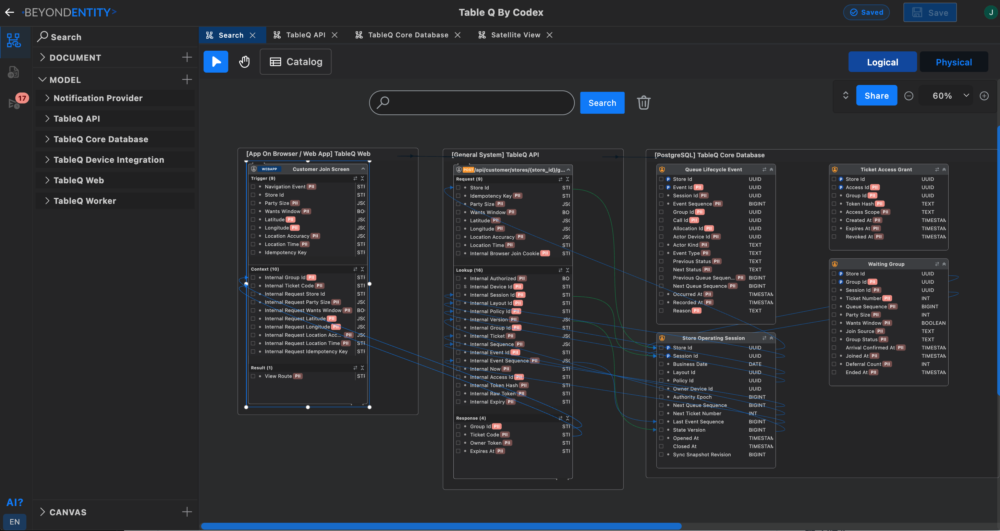
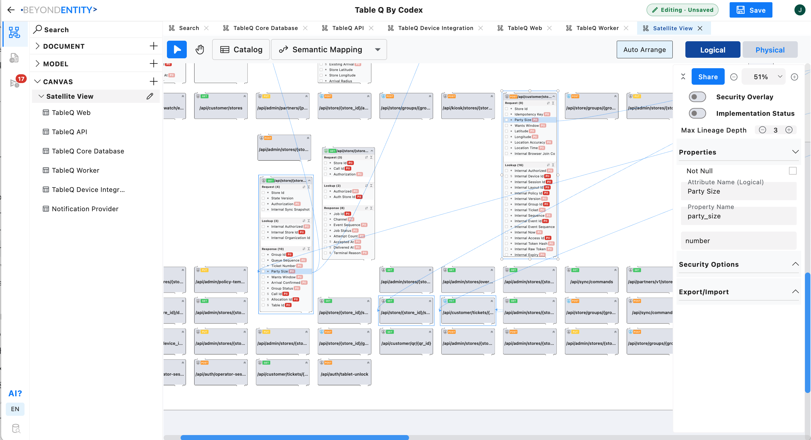

# Beyond Entity — Architecture Memory for AI Coding Agents

[English](README.md) · [한국어](README_ko.md) · [日本語](README_ja.md)

Beyond Entity は、AI エージェントとエンジニアが共有する永続的な Architecture Memory です。システムの意図、設計上の決定、モデル、データ契約、Processor の Transformation、実装のコンテキストを次の作業セッションへ引き継げます。

**beyond-entity-mcp** プラグインは、ローカルの Beyond Entity MCP サーバーを通じて、このメモリを AI によるコーディングに接続します。付属のスキルは、コンテキストの復元、コード変更前の設計確認、検証済みの実装変更に合わせた設計更新、次のエージェントや人への Checkpoint 作成を案内します。

Beyond Entity は MCP（Model Context Protocol）を通じて、Claude Code や Codex とともに **ソフトウェアアーキテクチャのモデリング**、**アーキテクチャ図**、**データリネージ**、**設計に基づくコーディング**に利用できます。

[Beyond Entity をダウンロード](https://beyondentity.com/en/download) · [インストールガイド（英語）](INSTALL.md) · [ユーザーガイド](docs/USER_GUIDE_ja.md) · [サンプル（英語）](samples/README.md) · [ウェブサイト](https://beyondentity.com) · [GitHub](https://github.com/beyond-entity/beyond-entity)

[](https://canvas.beyondentity.com/viewsample?sample_project_file_id=rXxLCaaJ1nEVN9CKbneL)

*Web 操作から API の Transformation を経てデータベースの Attribute まで追跡できます。画像をクリックすると Viewer で Table Q を探索できます。*

## 設計からでも既存コードからでも始められる

どちらの方向からも Architecture Memory を構築できます。

- **設計から始める。** MCP を通じて要件を Beyond Entity の設計にするよう AI に依頼してください。システム境界、Entity、データ契約、Processor、Transformation を含めます。アプリで Web/App アーキテクチャ、ERD、API、ETL/ELT パイプライン、スケジューラーを直接設計したり、AI と共同作業したりすることもできます。一緒にレビューして改善した後、実装を依頼します。
- **既存コードから始める。** コードベースを調べてアーキテクチャとデータフローを抽出し、MCP でモデルと設計文書を Beyond Entity に記録するよう依頼します。抽出した設計をレビューし、コードで確認できた事実、推定した意図、未解決の質問を区別してください。

どちらも、コーディング中に設計を共有の参照先として使い、検証済みの実装変更との整合性を保つ流れにつながります。一つの機能やサービスから始め、必要に応じてメモリを広げられます。

## コーディング中に AI が設計を参照するよう依頼する

機能実装、バグ修正、リファクタリングの前に Beyond Entity を確認するよう依頼してください。エージェントは MCP で関連 Processor の Transformation、入出力契約、依存関係を読み、その情報に基づいて変更できます。

要求された動作がアーキテクチャを変える場合は、対応する BE 設計も更新し、変更理由を記録させてください。開発全体で設計を活用でき、次の担当者へコンテキストを残せます。設計の参照はエージェントの作業手順であり、生成コードの一致を自動的に保証するものではありません。実装を設計と照合して検証してください。

## 作業の流れ

1. **コンテキストを復元する。** 最新の Checkpoint と関連文書を読み、他のエージェントや人による変更を確認します。
2. **設計を確認する。** コード変更前に対象 Processor と現在の Transformation、入出力 Entity、Attribute を読みます。
3. **実装して同期する。** 要求された変更を実装し、モデル上の動作が変わる場合は設計も更新します。コードとの差分をすべて意図した変更とみなさず、不一致の理由を調べます。
4. **検証して引き継ぐ。** 実装と設計の一致を確認し、完了した変更、理由、検証内容、残る作業を Checkpoint に記録します。

プロジェクトの読み書きは MCP を通じて行います。スキルは古い会話だけに頼ったり BE のプロジェクトデータベースを直接編集したりせず、最新状態を読み直すよう案内します。レビューのみの依頼では変更しません。

## 必要な詳細度でアーキテクチャを探索する

基本モデル画面は、すべての Attribute が展開された状態で表示されます。Satellite View とユーザー作成の Canvas は Entity や Processor の名前を中心としたコンパクトなボックスで始まり、大きな図も読みやすく保ちます。詳細が必要なときは、ボックスの展開ボタンで Attribute を表示してください。

折りたたみは表示方法の変更であり、Attribute が存在しないという意味ではありません。全体を確認してから、作業に関係する部分だけを展開できます。

[](https://canvas.beyondentity.com/viewsample?sample_project_file_id=rXxLCaaJ1nEVN9CKbneL)

*Canvas 全体をコンパクトに保ち、必要な Entity や Processor だけを展開して Attribute とマッピングを確認できます。画像をクリックすると Viewer が開きます。*

## Beyond Entity と Archify を比較する

[Archify](https://github.com/tt-a1i/archify) のような AI アーキテクチャ図ツールを検討していますか？ Archify はコードやシステムの説明から対話型 HTML/SVG 図を生成し、スナップショット比較やモデルに定義された経路の追跡をサポートします。

Beyond Entity は **AI コーディングエージェントのための Architecture Memory** に重点を置いています。編集可能な Entity、Attribute、Processor Transformation、ERD、データリネージに加え、Checkpoint で設計と実装のコンテキストをセッション間で引き継ぎます。人はアプリでモデルをレビューし、エージェントは MCP で読み取り、更新します。

ツールを比較する際は、対話型システム図を説明・共有したいのか、コーディング中にエージェントが参照・更新する共有設計を維持したいのかを検討してください。[Table Q の設計と実装](samples/table-q/README.md)で BE の流れを確認できます。両者は独立したプロジェクトであり、このリポジトリは Archify 連携や自動インポートを提供していません。

## 始め方

- [公式ダウンロードページ](https://beyondentity.com/en/download)から **macOS または Windows** 用の Beyond Entity をインストールします。
- [INSTALL.md](INSTALL.md) に従い、付属の `beyond-entity-mcp` サーバーと architecture-memory スキルを **Claude Code**（プラグインマーケットプレイス経由）または **Codex** に接続します。
- Beyond Entity でプロジェクトを開くか、以下のサンプルを探索してください。

MCP 実行ファイルはデスクトップアプリが提供します。このリポジトリはプラグイン設定と architecture-memory スキルを提供します。リポジトリのダウンロードだけでは、デスクトップアプリはインストールされません。

## 依頼例

**設計からコードへ**

> この機能を Entity、Processor、Transformation を含めて Beyond Entity で先に設計してください。その設計を参照して実装し、動作が一致するか検証してください。

**コードから設計へ**

> 既存のコードベースを調べ、MCP でアーキテクチャを Beyond Entity に記録してください。データ構造、処理の責務、データフローをモデル化し、確認が必要な設計意図を特定してください。

**設計を参照してコーディングする**

> 現在の Beyond Entity 設計を参照して、この機能を実装してください。編集前に関連 Processor の Transformation を読み、既存の契約を保ち、意図した設計変更は後で同期してください。

**共同作業を再開する**

> Beyond Entity をこのプロジェクトの Architecture Memory として使ってください。最新の Checkpoint を読み、前回の引き継ぎ以降の関連する変更をまとめてください。

> このエンドポイントを変更する前に、対応する Processor と Transformation の設計を確認し、現在の実装と比較してください。

> 今回の変更に合わせて実装と BE アーキテクチャを更新し、一致を検証して、次の開発者のための Checkpoint を残してください。

## サンプル

| サンプル | 確認できる内容 | リソース |
| --- | --- | --- |
| **Table Q by Codex** | 飲食店の待ち行列、テーブル状態、複数店舗の状況管理と Codex による実装 | [プロジェクトガイド](samples/table-q/README.md) · [Viewer](https://canvas.beyondentity.com/viewsample?sample_project_file_id=rXxLCaaJ1nEVN9CKbneL) |
| **eCommerce data lake** | Oracle → Google Cloud Storage → BigQuery の Lineage と売上・商品・顧客セッションの SQL 集計 | [プロジェクトガイド](samples/ecommerce/README.md) · [Viewer](https://canvas.beyondentity.com/viewsample?sample_project_file_id=BWBDcESJ4tJcGkZqvRwL) |
| **Databricks Lakehouse** | Lakehouse 設計、Python ソース、ジョブ、テスト、Codex の会話要約 | [プロジェクトガイド](samples/databricks/README.md) |
| **Snowflake Enterprise ELT** | ELT 設計、SQL、Python パイプライン、DAG、テスト、Claude Code の会話要約 | [プロジェクトガイド](samples/snowflake/README.md) |

[Databricks と Snowflake の比較](samples/COMPARISON.md)：設計、実装構造、修正事例、ビジネス上の質問を比較します。サンプルガイドと比較文書は英語です。

各ガイドには `.bemdl` のダウンロードリンクがあります。Table Q には [Codex が生成した実装](samples/table-q/src/)とデータベーススキーマが含まれています。実行前に [Table Q のセットアップ案内](samples/table-q/README.md)を確認してください。

[その他のサンプル →](https://beyondentity.com/en/sample-projects)

## リポジトリ構成

```text
.
├── README.md
├── README_ko.md
├── README_ja.md
├── docs/                              # User guides in English, Korean, and Japanese
├── INSTALL.md
├── assets/screenshots/                 # README screenshots
├── .claude-plugin/marketplace.json      # Claude Code plugin marketplace
├── plugins/
│   └── beyond-entity-mcp/
│       ├── .claude-plugin/plugin.json   # Claude Code plugin manifest
│       ├── .codex-plugin/plugin.json    # Codex plugin manifest
│       ├── .mcp.json                    # MCP server (command: beyond-entity-mcp)
│       └── skills/architecture-memory/
│           ├── SKILL.md
│           └── references/modeling-principles.md
└── samples/
    ├── README.md
    ├── table-q/
    │   ├── README.md
    │   ├── src/                         # Codex-generated implementation
    │   └── db/                          # Initial schema and schema verification
    ├── ecommerce/README.md
    ├── databricks/                      # Python package, jobs, tests, architecture notes
    ├── snowflake/                       # SQL, Python pipelines, Airflow DAGs, tests
    └── COMPARISON.md
```

このリポジトリは **Claude Code プラグインマーケットプレイス**（`.claude-plugin/marketplace.json`）を自身で提供し、同等の目的の Codex プラグインも含んでいます。公開 Git リポジトリへ配布すると、中央の審査を経ずにユーザーが追加できます（[INSTALL.md](INSTALL.md) 参照）。Anthropic のコミュニティプラグインディレクトリへの掲載は、別途任意で申請するものです。

## ライセンス

このリポジトリのプラグイン設定、スキル、文書、サンプルコードには MIT License が適用されます。Beyond Entity デスクトップアプリと別途配布する MCP 実行ファイルには、それぞれの製品のライセンス条項が適用されます。サードパーティーの構成要素には、それぞれのライセンスが適用されます。
