# User guide: from requirements to implementation

[English](USER_GUIDE.md) · [한국어](USER_GUIDE_ko.md) · [日本語](USER_GUIDE_ja.md)

Explore [Databricks](../samples/databricks/README.md), [Snowflake](../samples/snowflake/README.md), and the [comparison guide](../samples/COMPARISON.md) for the sample architectures and conversation notes.

Use Beyond Entity as shared architecture memory throughout a project: describe the system, design it with an AI agent, review its data flows, implement the design, and keep the design current as code changes.

This guide uses Databricks and Snowflake design examples, with Table Q for the ERD and implementation examples. They are separate projects, not consecutive states of one project. You can follow the same workflow for web and app architectures, APIs, databases, ETL/ELT pipelines, and schedulers.

**Before you start:** install the desktop app, connect MCP, and add the `architecture-memory` skill using [INSTALL.md](../INSTALL.md). The desktop app provides the visual workspace; MCP lets the agent read and update the project; the skill guides how the agent uses that memory.

Screenshots show macOS examples. Use the installation instructions for your own environment. Click any screenshot to open the full-resolution image. Prompts below can be copied and adapted to your project.

## Contents

1. [Connect and verify your agent](#1-connect-and-verify-your-agent)
2. [Create or open a project](#2-create-or-open-a-project)
3. [Describe the system and ask AI to design it](#3-describe-the-system-and-ask-ai-to-design-it)
4. [Start from existing code](#4-start-from-existing-code)
5. [Review the design visually](#5-review-the-design-visually)
6. [Read checkpoints and implementation status](#6-read-checkpoints-and-implementation-status)
7. [Implement the reviewed design](#7-implement-the-reviewed-design)
8. [Bring code changes back into Beyond Entity](#8-bring-code-changes-back-into-beyond-entity)
9. [Resume with another agent or a teammate](#9-resume-with-another-agent-or-a-teammate)

## 1. Connect and verify your agent

Open the desktop app's settings and select **MCP setup guide**. Follow the [installation guide](../INSTALL.md) for Claude Code or Codex, including the architecture-memory skill. A working MCP connection alone does not establish that the skill is installed.

The screenshots use `beyond-entity` as the connection name and a macOS executable path. The current installation guide uses `beyond-entity-mcp` and a PATH-based command. Reuse an existing working connection instead of adding a duplicate.

After setup, ask:

> Use Beyond Entity MCP to list my available projects. Report the project names and IDs without changing anything.

**Check:** the response contains your actual projects. If none exist yet, create one in the next step. If the call fails, resolve the connection issue before continuing.

<a href="../assets/screenshots/mcp_setting_codex.png">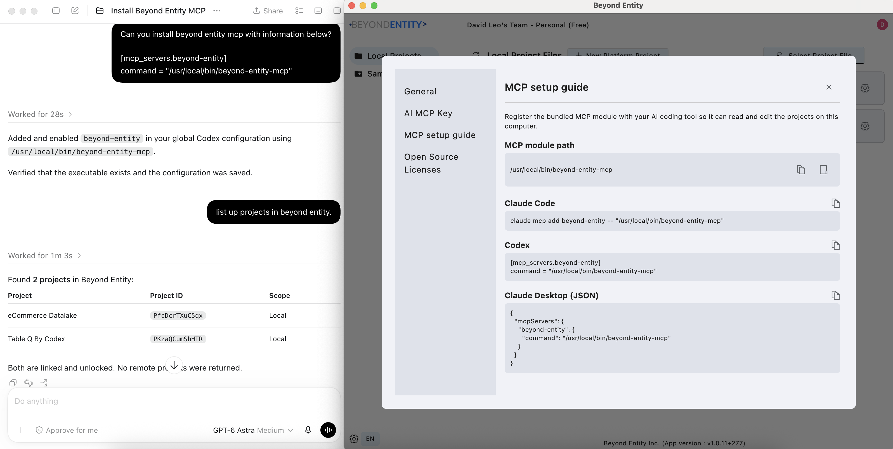</a>

*Codex example. Locate MCP setup guide on the right, then confirm the project-list response on the left.*

Claude Code connection example

<a href="../assets/screenshots/mcp_setting_claude.png">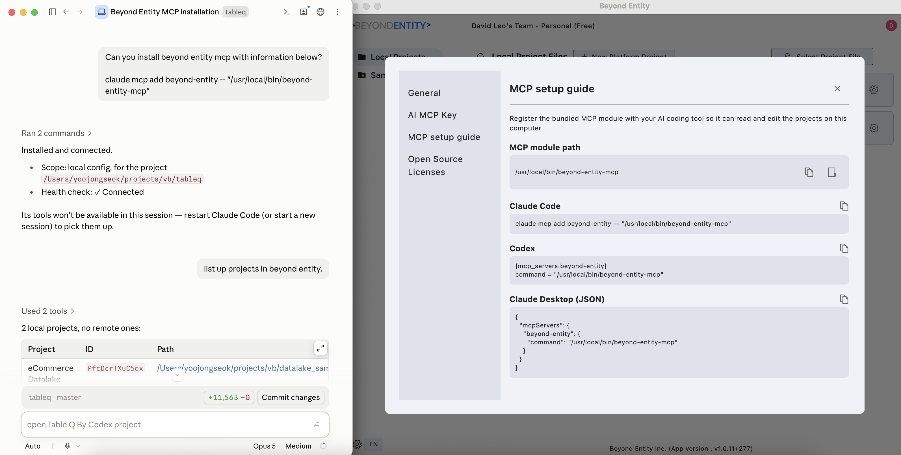</a>

*Claude example. Follow INSTALL.md for the current configuration and skill setup.*

## 2. Create or open a project

You can ask the agent to create a project or create one directly in Beyond Entity.

### Ask the agent

Give it a project name and a folder it can access:

> Create a new local Beyond Entity project named “Retail Analytics” in [project folder]. Use MCP to create it. Report the resulting project name, ID, and file location, and read the initial project documents.

**Check:** the new project appears in the desktop app's local project list. Open that project and compare its name with the agent's response.

<a href="../assets/screenshots/project_creation_by_ai.png">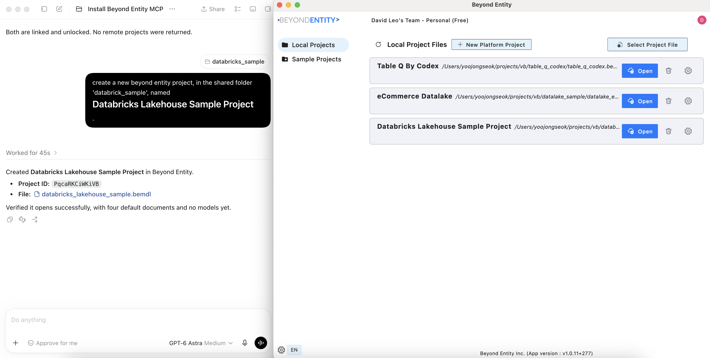</a>

*The creation result on the left corresponds to the new project row and Open button on the right.*

### Create it yourself

Choose **New Platform Project** in the local project list. In the **New Local Project** dialog, enter the project name, choose its location, provide the file name, and select **Create**.

For an existing file, use **Select Project File**. Ask the agent to list projects again and identify the intended project before making changes.

<a href="../assets/screenshots/project_creation_by_user.png">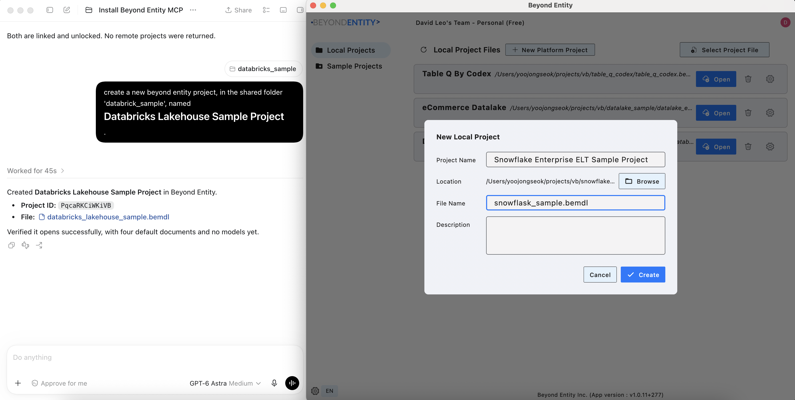</a>

*Use the dialog on the right for manual creation. The Databricks conversation on the left is from a separate example; this dialog creates a Snowflake project.*

## 3. Describe the system and ask AI to design it

Open **DOCUMENT → about_this_system.md**. Record the system's objective, users, workflows, source systems, outputs, and constraints. Use **Code/Text** to edit and **Save** to save the document, or ask the agent to update it through MCP.

Include the requirements that should shape the design: security boundaries, failure handling, processing frequency, and what is outside the project's scope.

> Read this project's documents through MCP. Update about_this_system.md with the requirements below. Identify unclear requirements and record assumptions explicitly before designing: [requirements].

<a href="../assets/screenshots/edit_about_this_system_document.png">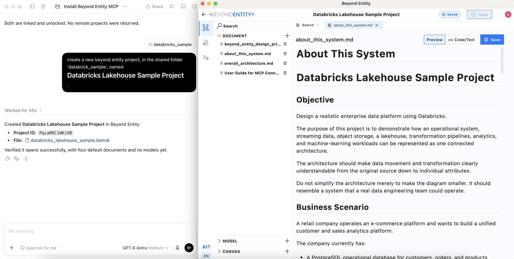</a>

*Review the objective and business scenario in about_this_system.md. Code/Text and Save are at the upper right.*

Once the requirements are clear, ask:

> Use Beyond Entity as architecture memory for this project. Read its latest documents and design state through MCP. Design the system boundaries, entities, data contracts, processors, and transformations for these requirements. Work in reviewable stages. Keep the architecture documents aligned with the models, and leave a checkpoint after each milestone with decisions, checks, and open questions. Do not begin coding yet.

You can also model directly in the app and ask the agent to extend or review your work. Before it continues, have it read the latest state so it sees your edits.

<a href="../assets/screenshots/snowflask_start_design.png">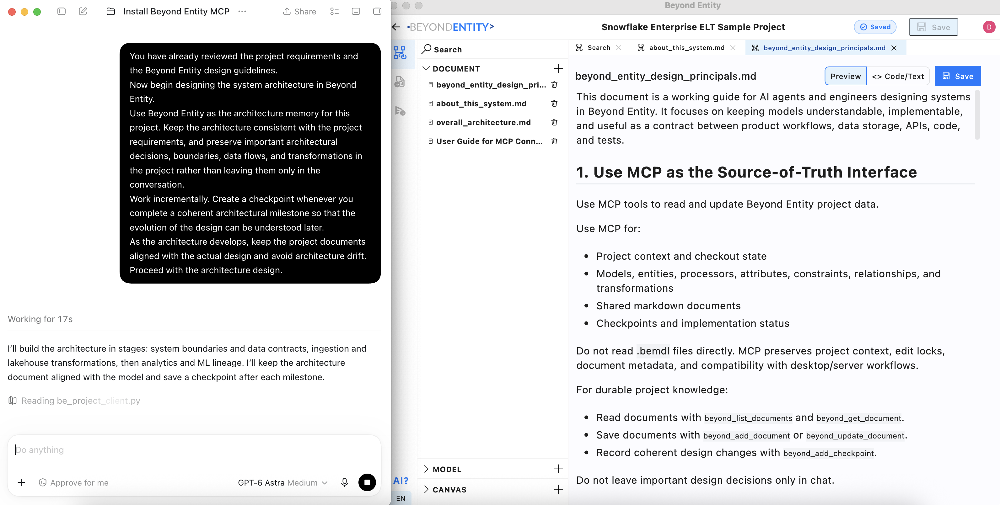</a>

*This Snowflake example asks the agent to preserve decisions, data flows, and transformations in the project and record milestones.*

## 4. Start from existing code

If an implementation already exists, start with a bounded area such as one service or workflow. Give the agent access to the source folder and identify the Beyond Entity project to update.

> Inspect [source folder] for [workflow or service]. Read the current Beyond Entity project through MCP, then record the architecture represented by this code: system boundaries, storage entities, APIs, processors, contracts, and transformations. Distinguish code-backed facts from inferred intent and unresolved questions. Record source references where useful. Do not change the implementation in this step.

**Check:** compare a representative endpoint or job with its extracted design. Confirm that the model includes its actual inputs, outputs, storage access, and failure behavior. Resolve uncertainty before treating the extracted design as an implementation contract.

## 5. Review the design visually

Review from the overall system down to an individual transformation. The desktop screenshots below include editing controls; the public sample Viewer is useful for exploring the architecture, while project changes belong in the desktop/MCP workflow.

### See the overall architecture

Open **CANVAS → Satellite View**, or select its tab if it is already open. Use the zoom controls to bring the system groups into view and pan around the canvas. Review the system names and boundaries before following individual attributes.

<a href="../assets/screenshots/databricks_review_in_satellite_view.png">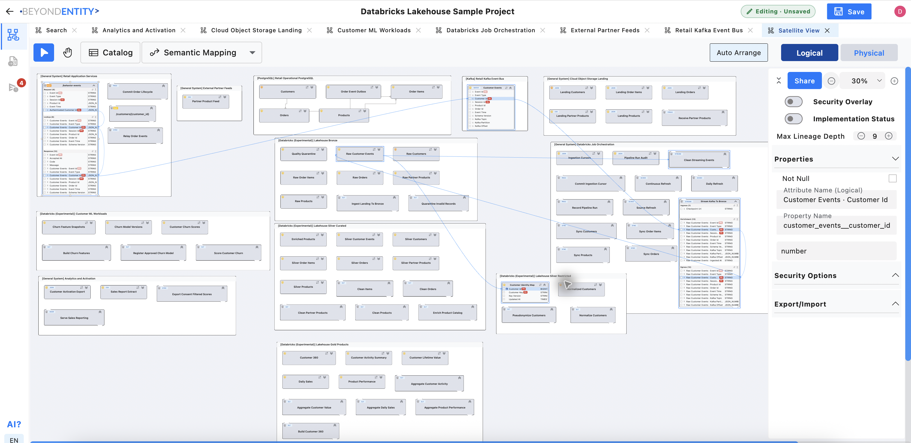</a>

*Start with the Satellite View tab, system groups, and zoom controls. This overview also shows a selected attribute and its connected lineage.*

### Expand and collapse details

Base model views display all attributes by default. Satellite View and user-created canvases start with compact entity and processor boxes. Click a box's upper-right expand/collapse control to show or hide its attributes.

Expand the objects you want to inspect while leaving unrelated boxes compact. Collapsing a box changes its presentation; it does not remove attributes from the design.

<a href="../assets/screenshots/snowflask_review_by_satellite_view.png">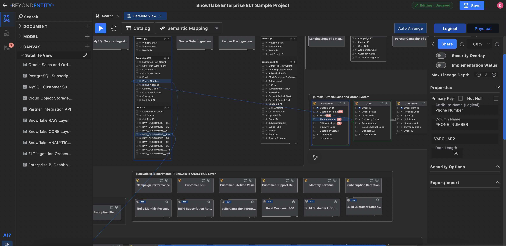</a>

*Compare the compact analytics boxes below with the expanded Customer entity above. Use each box’s upper-right control to change its display.*

### Inspect the ERD

Under **MODEL**, open the database model. Review entities, attributes, key markers, and relationship lines. Use **Logical / Physical** to compare business-facing names with implementation names.

> Review this database model against the requirements. Explain its keys and relationships, and identify missing constraints or ambiguous ownership. Read the current model through MCP before proposing changes.

<a href="../assets/screenshots/database_review_using_erd.png">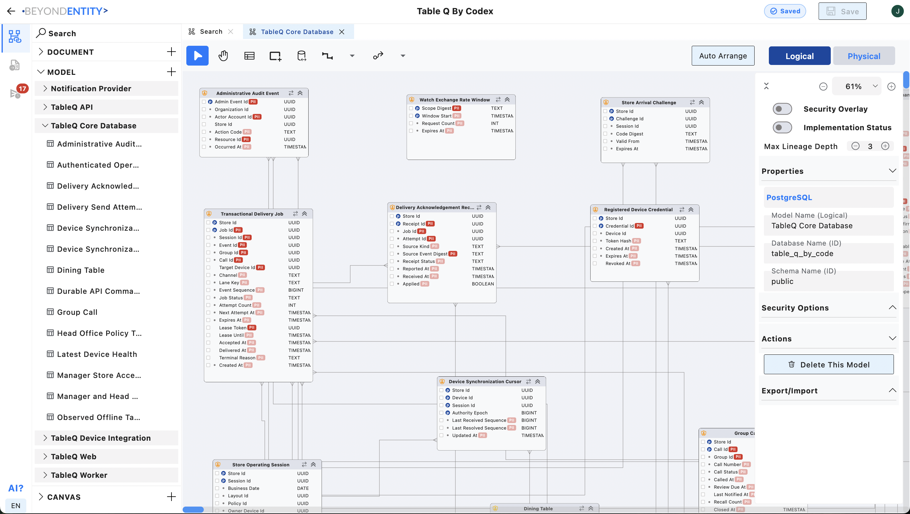</a>

*Table Q ERD example. Start with the model in the left sidebar, then inspect its tables and relationships.*

### Search and trace lineage

Use **Search** to find a relevant name, such as `email`. Then click an **entity, processor, or attribute** to reveal its connected data flows. Select a specific attribute when you want to trace an individual value through the system.

Searching helps locate the subject; selecting it establishes what you are tracing.

*Locate the search field, the selected Email attribute, its blue connection lines, and the attribute details on the right.*

### Change lineage depth

In the right-side panel, use the **− / +** controls beside **Max Lineage Depth** to adjust how many connection steps to follow. Keep the same object selected when comparing depths. A smaller depth helps focus on nearby connections; a larger depth lets you investigate farther across the architecture.

If a flow is difficult to follow, expand the relevant boxes and adjust zoom as well. Depth controls the trace range; zoom controls how large the canvas appears.

### Read a processor's Transformation

Select the relevant processor and open **Transformations** in its properties. Read the processing rules alongside its input, lookup/context, and output attributes. Attribute connections show where data travels; the Transformation explains how the processor derives or handles it.

Check business rules, validation, error handling, state changes, and the output contract. For ETL/ELT, also check where the transformation runs and which data it reads and writes.

> Read this processor and its transformations through MCP. Explain its inputs, processing rules, outputs, and failure cases. Compare them with [requirement] and identify any gaps before implementation.

## 6. Read checkpoints and implementation status

Open the **Implementation Status** area in the left navigation, then choose **Checkpoints**. Open an entry and read its author, timestamp, message, and status snapshot.

A useful checkpoint explains what changed, why it changed, what was verified, and what remains. Checkpoint status is a snapshot at that time; use the current **Implementation Status** and **Test Status** views to review the present state.

A recorded implementation status does not by itself establish that runtime tests passed. Compare it with the test evidence and any limitations described by the agent.

<a href="../assets/screenshots/databricks_checkpoint.png">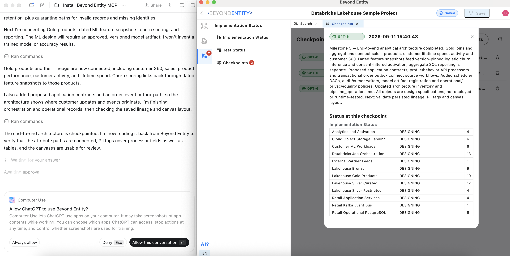</a>

*This checkpoint explicitly describes design specifications and shows DESIGNING statuses. The computer-use permission prompt on the left belongs to that captured session and is not a required checkpoint step.*

The next example records a later problem found during implementation and the architecture changes made to address it.

*Read the milestone, reason for the new design, and affected objects. The Changed by MCP and Refresh controls above indicate that the app has detected an external update. Refresh to load it, resolving any unsaved local work first.*

## 7. Implement the reviewed design

Choose a small, reviewed part of the system. Provide the code location, identify the relevant design, and ask the agent to re-read it before implementing.

> Implement [workflow] in [source folder] using the reviewed Beyond Entity design. First read the latest checkpoint, relevant processor transformations, data contracts, and dependencies through MCP. Explain any ambiguity before choosing behavior. Implement the workflow, run the appropriate checks, and update its implementation and test status to reflect the evidence. Leave a checkpoint with changed files, verification results, and remaining limitations.

**Review the result:** compare the code's inputs, outputs, rules, and error handling with the Transformation. Check which tests actually ran and which depend on an unavailable service or environment. Ask the agent to read the design back after updates.

The captured progress below illustrates an agent reporting checks, finding an orchestration gap, updating Beyond Entity, and preparing to verify contract alignment. These messages are an example of the workflow, not an independent verification of those results.

<a href="../assets/screenshots/codex_comment.png">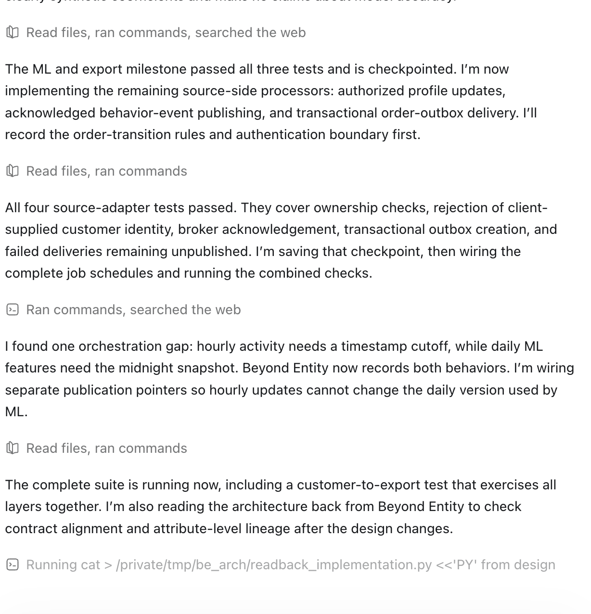</a>

*Look for concrete design changes and verification details in the agent’s report.*

For an example implementation with source code and a running-interface screenshot, see [Table Q by Codex](../samples/table-q/README.md).

## 8. Bring code changes back into Beyond Entity

When requirements or code change, revisit the architecture. Do not automatically turn every code difference into a new design rule: the difference may be a bug, an intentional change, or an unresolved decision.

> Compare the changes in [files or commit] with the latest Beyond Entity design. Classify differences as intentional behavior changes, implementation defects, or unresolved decisions. Update the relevant transformations, contracts, relationships, and architecture documents for the intentional changes through MCP. Preserve unrelated edits by other people or agents. Verify the updated design against the code and record a checkpoint with the reason, checks, and remaining issues.

**Check:** inspect the changed Transformation, trace its affected attributes, and read the new checkpoint. Confirm that updated statuses match the checks actually performed. If the app shows **Changed by MCP**, load the latest state before reviewing.

## 9. Resume with another agent or a teammate

Start each new work session by recovering current context rather than relying on the previous conversation.

> Open [Beyond Entity project] through MCP. Read the latest checkpoint, relevant documents, and the current design for [task]. Check the current code and changes since the last recorded work, including changes by other agents or humans. Summarize completed work, unresolved differences, and the next step before making edits. If the checkpoint does not contain enough information to establish what changed, say so.

A checkpoint helps recover intent, but it is not a substitute for inspecting current design and code. Finish the session by recording the decisions and evidence the next contributor will need.

---

[Back to README](../README.md) · [Installation guide](../INSTALL.md) · [Sample projects](../samples/README.md)
