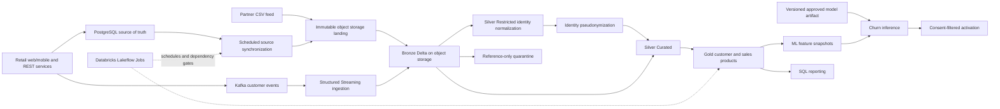

# Databricks Lakehouse Sample Project — Overall Architecture

Project: `PqcaRKCiWKiVB`. All designed processors are implemented and verified locally; no deployment or trained-model accuracy is claimed.

## Current milestone
Implementation complete locally: 12 models, 43 entities, 37 processors, 84 transformations and 3 PostgreSQL relationships. All processor implementations are DRAFT_IMPLEMENTED with local test evidence and explicit live-integration limitations. See implementation_status.md and implementation_verification_findings.md.

## System boundaries
Bronze, Silver Restricted, Silver Curated, Gold and ML are governance schemas within one proposed Unity Catalog catalog, `retail_lakehouse`. They are not independent workspaces. PostgreSQL, applications, messaging, partner delivery, landing storage, job orchestration and reporting are separate ownership/runtime boundaries.

| Key | Model | Model ID | Storage type |
|---|---|---|---|
| pg | Retail Operational PostgreSQL | `mdl_CYL7xTjTkE` | postgresql |
| app | Retail Application Services | `mdl_nk805aYIIZ` | general_system |
| kafka | Retail Kafka Event Bus | `mdl_XXDHte1HLs` | kafka |
| partner | External Partner Feeds | `mdl_bCT45Hye8m` | general_system |
| landing | Cloud Object Storage Landing | `mdl_ZmfO7xZgwM` | general_system |
| bronze | Lakehouse Bronze | `mdl_DJ89kBvNEz` | databricks |
| restricted | Lakehouse Silver Restricted | `mdl_ryWxQJPuxc` | databricks |
| silver | Lakehouse Silver Curated | `mdl_DJhdLE9wLn` | databricks |
| gold | Lakehouse Gold Products | `mdl_cwxV0LiSfP` | databricks |
| jobs | Databricks Job Orchestration | `mdl_CrG1Eh7mKY` | general_system |
| ml | Customer ML Workloads | `mdl_jEcr3WTjF6` | databricks |
| bi | Analytics and Activation | `mdl_wZAPK2grEm` | general_system |

## Architecture diagram

Kafka writes directly to Bronze Delta; Delta is persisted on cloud object storage. Batch/partner files use a separate immutable landing zone. This avoids requiring a redundant intermediate Kafka file sink.

## Data contract inventory
PK markings in Delta designs denote logical grain, not enforced database uniqueness. Pipeline quality gates enforce uniqueness and referential expectations. PostgreSQL FK relationships are modeled separately.

| Contract | Entity ID | Boundary | Grain |
|---|---|---|---|
| `customers` | `ent_FAx5SGcXPR` | pg | one row per customer identifier |
| `orders` | `ent_uy7P88QGJZ` | pg | one row per order identifier |
| `order_items` | `ent_10o2UbNHK4` | pg | one row per order_item identifier |
| `products` | `ent_dFaNHfD9Qu` | pg | one row per product identifier |
| `landing_customers` | `ent_A07a85SVvL` | landing | one source row version within a batch |
| `raw_customers` | `ent_SKb1zSaz6y` | bronze | source identifier + batch_id + source_file |
| `landing_orders` | `ent_wMSM4eqeVi` | landing | one source row version within a batch |
| `raw_orders` | `ent_PORZLH9qQU` | bronze | source identifier + batch_id + source_file |
| `landing_order_items` | `ent_5dU4N997kR` | landing | one source row version within a batch |
| `raw_order_items` | `ent_z2tcO1gvAz` | bronze | source identifier + batch_id + source_file |
| `landing_products` | `ent_SXTZ6E6QUZ` | landing | one source row version within a batch |
| `raw_products` | `ent_eBfq2md9C9` | bronze | source identifier + batch_id + source_file |
| `customer_events` | `ent_DZlRQfDL7X` | kafka | event_id (business); topic + partition + offset (delivery) |
| `raw_customer_events` | `ent_teYDsy8xoQ` | bronze | topic + partition + offset |
| `partner_product_feed` | `ent_v278wGjO40` | partner | partner_id + product_code + effective_date |
| `landing_partner_products` | `ent_9NuDZBOePx` | landing | file checksum + row number |
| `raw_partner_products` | `ent_ksFLH3Zv3B` | bronze | partner_id + product_code + effective_date + source_file |
| `normalized_customers` | `ent_lqOnmdrh8Y` | restricted | customer_id |
| `silver_customers` | `ent_YmnGZVd5Dv` | silver | customer_key |
| `customer_identity_map` | `ent_mithD0HEPM` | restricted | customer_id |
| `silver_orders` | `ent_FYCjL55yKd` | silver | order_id |
| `silver_order_items` | `ent_Rx7H3w1tX6` | silver | order_item_id |
| `silver_products` | `ent_C8KX6k7Kp6` | silver | product_id |
| `silver_partner_products` | `ent_Ld389mx9J5` | silver | product_code |
| `silver_customer_events` | `ent_6t1pXsm8yq` | silver | event_id |
| `enriched_products` | `ent_cnCXLVeilJ` | silver | product_id |
| `daily_sales` | `ent_15YSLF4yxr` | gold | sales_date + currency |
| `product_performance` | `ent_BdngIzYqgF` | gold | sales_date + product_id + currency |
| `customer_lifetime_value` | `ent_2jENfEBi65` | gold | customer_key + currency |
| `customer_activity_summary` | `ent_tUWHIbc7GU` | gold | customer_key + activity_date |
| `customer_360` | `ent_BHRlLa4kUa` | gold | customer_key + currency |
| `churn_feature_snapshots` | `ent_yF4WKy5yaN` | ml | customer_key + as_of_date + currency |
| `churn_model_versions` | `ent_VE89BLuTnx` | ml | model_version |
| `customer_churn_scores` | `ent_AeqUBObaKa` | ml | customer_key + as_of_date + model_version + currency |
| `customer_activation_export` | `ent_sjLiToAlxN` | bi | customer_key + as_of_date |
| `sales_report_extract` | `ent_RJMDXMcmez` | bi | sales_date + currency |
| `pipeline_run_audit` | `ent_XQEPTzi2jr` | jobs | run_id |
| `ingestion_cursors` | `ent_ComhX93Qfj` | jobs | source_table / stream query |
| `quality_quarantine` | `ent_C0yZCmnxw4` | bronze | reject_id |
| `order_event_outbox` | `ent_fe1q46uBrH` | pg | event_id |
| `customer_pipeline_publications` | `ent_nZGB4dSm1r` | jobs | batch_id |
| `pipeline_table_versions` | `ent_q6mBcLr5LB` | jobs | pipeline_name + run_id + table_name |
| `pipeline_epoch_dependencies` | `ent_O0xUAtXZAG` | jobs | consumer pipeline/run + source pipeline/run/table |

## Processors and transformation ownership

| Processor | ID | Model | Transformations |
|---|---|---|---|
| `sync_customers` | `proc_tLb4Vvc4IN` | jobs | 2 |
| `sync_orders` | `proc_l6hhYLa792` | jobs | 2 |
| `sync_order_items` | `proc_O4QuAZheX5` | jobs | 2 |
| `sync_products` | `proc_myHDLtCBL3` | jobs | 2 |
| `receive_partner_products` | `proc_cIt9it4kMm` | landing | 2 |
| `ingest_landing_to_bronze` | `proc_fM15NUfRm4` | bronze | 5 |
| `stream_kafka_to_bronze` | `proc_OiRRHIXDqQ` | jobs | 1 |
| `normalize_customers` | `proc_iV9fZ5QRIe` | restricted | 3 |
| `pseudonymize_customers` | `proc_VOPDc38HLm` | restricted | 3 |
| `clean_orders` | `proc_5gh3GHrz95` | silver | 3 |
| `clean_products` | `proc_Bw43kNAJLO` | silver | 3 |
| `clean_items` | `proc_Yqr7ZuRs9W` | silver | 3 |
| `clean_partner_products` | `proc_4bl6mv4kjN` | silver | 3 |
| `enrich_product_catalog` | `proc_GVyXMdEKUc` | silver | 2 |
| `clean_streaming_events` | `proc_eIaNup3Rc6` | jobs | 3 |
| `quarantine_invalid_records` | `proc_xPJZ3R43Lt` | bronze | 8 |
| `aggregate_daily_sales` | `proc_Q6qfSVR5f4` | gold | 2 |
| `aggregate_product_performance` | `proc_qbIcHBzelH` | gold | 2 |
| `aggregate_customer_value` | `proc_5PKFGwJldj` | gold | 2 |
| `aggregate_customer_activity` | `proc_hOx6AKkHBB` | gold | 2 |
| `build_customer_360` | `proc_GFPKimY22l` | gold | 2 |
| `build_churn_features` | `proc_2jj713mipX` | ml | 2 |
| `score_customer_churn` | `proc_dsDpnPvrBJ` | ml | 2 |
| `export_consent_filtered_scores` | `proc_THr6W7ng5J` | bi | 2 |
| `serve_sales_reporting` | `proc_uwAuQ4IwoG` | bi | 2 |
| `updateCustomerProfile` | `proc_JdSrpuLm7H` | app | 2 |
| `captureBehaviorEvent` | `proc_hVkJwN3rKM` | app | 2 |
| `commit_order_lifecycle` | `proc_0YuGq2K03Y` | app | 2 |
| `relay_order_events` | `proc_rJlLx1AwTo` | app | 3 |
| `record_pipeline_run` | `proc_BTuhhECFqG` | jobs | 1 |
| `commit_ingestion_cursor` | `proc_GQhF914SlZ` | jobs | 1 |
| `register_approved_churn_model` | `proc_RNg283PYQO` | ml | 1 |
| `daily_refresh` | `proc_MxtH5pMC0K` | jobs | 1 |
| `source_refresh` | `proc_Opa4pYbUjY` | jobs | 1 |
| `continuous_refresh` | `proc_OHIQNdX1t9` | jobs | 1 |
| `commit_customer_publication` | `proc_ayX5zANz9O` | jobs | 2 |
| `publish_pipeline_epoch` | `proc_udU4f93bLK` | jobs | 2 |

## Source-of-truth and lifecycle rules
- Requirements: about_this_system.md remains the authoritative product brief. This document records the actual design inventory; architecture_decisions.md records chosen sample policies.
- Project contracts and transformations are maintained through Beyond Entity MCP. SQL stored on processors expresses design mappings over modeled tables/ports. Exported transformations execute through staged Spark SQL and controlled source/sink adapters with local tests; deployment remains separate.
- Existing generic architecture template examples (MySQL, BigQuery and Beserv) do not apply to this Databricks sample.
- Keep all implementation and test status evidence-based. All 37 processors are DRAFT_IMPLEMENTED; test statuses carry live-integration warnings, not production certification.
- Job checkpoints record architectural milestones; they are distinct from Structured Streaming runtime checkpoint directories.
- beyond_entity_design_principals.md is truncated in the stored source at section 9. The available text was applied without inventing missing guidance.

## Technical references
The design uses the layered quality pattern and operational checkpoint concepts documented by Databricks. Concrete cadence, retention, ownership and privacy policies below are sample decisions, not prescribed vendor defaults.
- [Medallion architecture](https://docs.databricks.com/aws/en/lakehouse/medallion)
- [Structured Streaming checkpoints](https://docs.databricks.com/aws/en/structured-streaming/checkpoints)
- [Watermarks](https://docs.databricks.com/aws/en/structured-streaming/watermarks)

## Reading the architecture
Open Satellite View for the compact system overview. The model canvases expose full data contracts and processor ports. Use attribute lineage search to follow the paths in architecture_validation.md. The compact view is intended for collapsed objects; expand a detailed model canvas when inspecting many attributes. Layout is a navigation aid, not a substitute for the persisted SQL transformations and source/target mappings.

## Memory documents
- about_this_system.md: original retail lakehouse requirements, preserved.
- architecture_decisions.md: ownership, ingestion, replay, PII, metrics, ML and retention decisions.
- application_contracts.md: implemented API and order-outbox source contracts; deployment bindings remain required.
- pipeline_operations.md: scheduler/task IDs, dependencies, gates, retry/replay and privacy lifecycle.
- architecture_validation.md: read-back evidence, requirements coverage and remaining implementation work.

## Deployment work
All designed pipeline code, job mappings and local tests are delivered. Infrastructure, grants, actual source/partner integration, trusted credential verification, approved model release, physical retention/privacy operations and live workspace validation remain deployment work. No business credentials or real coefficients are fabricated.

## Customer implementation milestone
Added `customer_pipeline_publications` (entity `ent_nZGB4dSm1r`) and `commit_customer_publication` (processor `proc_ayX5zANz9O`) in job orchestration. The manifest records predecessor/baseline and pinned raw/normalized/identity/Silver Delta versions. `ingestion_cursors.checkpoint_uri` releases the immutable manifest to readers. This is a control-plane contract; all existing customer attribute transformations and PII boundaries remain intact. See ADR-010 and customer_pipeline_implementation.md for the implemented protocol, code mapping, historical 12-test milestone and publication reasoning. Shared processors are now fully covered by the final implementation map; milestone evidence remains historical.

## General publication and implementation decisions
ADR-012 adds pipeline_table_versions and pipeline_epoch_dependencies plus publish_pipeline_epoch for source, partner, Silver, Gold, live activity and ML epochs. Individual Delta writes are not a multi-table transaction: readers pin versions released by a conditional cursor. ADR-013 freezes complete ML feature partitions and defines consent-refresh/export recovery. ADR-014 implements authorized source APIs and transactional outbox with broker acknowledgements. ADR-015 maps the actual paused 10-job graph and separates live activity versions from daily feature inputs. Runtime cross-session view isolation, live-export corrections and event-conflict findings are preserved in implementation_verification_findings.md and checkpoints.
