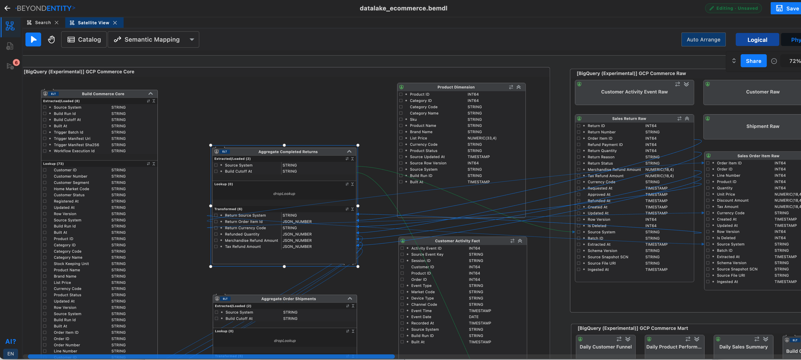

# eCommerce data lake

This illustrative project models an eCommerce data lake from an on-premise Oracle database, through scheduled file transfers using Google Cloud Storage, to BigQuery tables and SQL aggregations.

It demonstrates source-to-target lineage for daily sales summaries, product performance metrics, and customer session funnels. The published description identifies English documentation and a local SQL demo; it is not a production-ready pipeline or a live cloud deployment.

*Satellite View connects ELT processors and BigQuery entities through attribute-level lineage. Click the screenshot to explore the sample architecture.*

## Beyond Entity project

- **File:** `datalake_ecommerce.bemdl`
- **Viewer:** [Explore the architecture](https://canvas.beyondentity.com/viewsample?sample_project_file_id=BWBDcESJ4tJcGkZqvRwL)
- **Download:** [Download the BE project](https://control.beyondentity.com/api/sample_project/BWBDcESJ4tJcGkZqvRwL/download)
- **Source description:** [Official sample catalog](https://beyondentity.com/en/sample-projects)

Use the viewer to inspect the design, or open the downloaded `.bemdl` file in Beyond Entity. This repository entry provides project documentation and links; no separate source-code directory is included for this sample.

## Explore with an agent

After following the [installation guide](../../INSTALL.md), ask:

> Read the project context and trace a daily sales output back through its transformations to the Oracle source attributes. Explain the storage and processing boundaries.

Review actual models and transformations through MCP before implementing or changing a pipeline based on this example.
