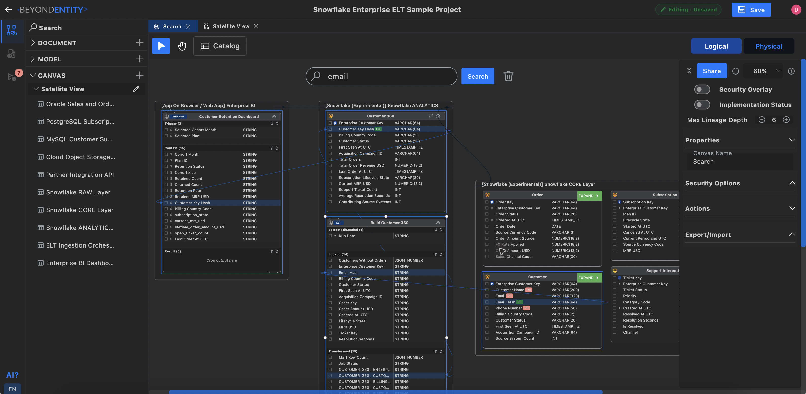
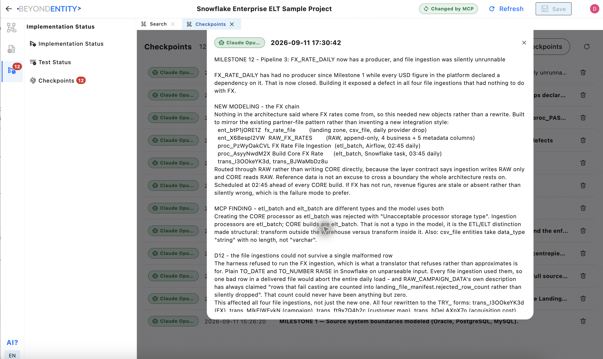

# Snowflake Enterprise ELT sample

A retail analytics example that lands operational and partner data in Snowflake RAW, conforms it in CORE, and produces ANALYTICS marts for modeled BI dashboards. The supplied Claude Code conversation shows implementation exposing missing business rules and defects, followed by explicit corrections in Beyond Entity.

- **BE file:** `snowflask_sample.bemdl` (the original file name)
- **Viewer:** [Explore the architecture](https://canvas.beyondentity.com/viewsample?sample_project_file_id=ULbLp9iGQNLXCF4U1Vt8)
- **Download:** [Download the BE project](https://control.beyondentity.com/api/sample_project/ULbLp9iGQNLXCF4U1Vt8/download)
- **Conversation:** [Selected reading notes](CONVERSATION.md)
- **Compare:** [Databricks and Snowflake](../COMPARISON.md)

<a href="../../assets/screenshots/snowflask_review_by_search.png"></a>

*Search for a subject, then select an entity, processor, or attribute to reveal its connected data flows.*

## Architecture and implementation

Cross-system ingestion is represented as modeled SQL for lineage, but extraction and loading must execute on their respective systems. The Python contract parser derives those parts from the modeled statement. Warehouse transformations execute through the SQL runner, while the local test harness translates supported Snowflake SQL to SQLite and rejects unsupported translations.

This distinction matters: a modeled cross-system flow does not mean one SQL statement can run unchanged across two databases.

### Included source layout

The implementation is included in sibling directories rather than one `src/` folder. The original project README is preserved as [IMPLEMENTATION.md](IMPLEMENTATION.md). The BE design is linked above, and selected conversation notes are in [CONVERSATION.md](CONVERSATION.md).

| Location | Purpose |
| --- | --- |
| [pipelines/](pipelines/) | Python contract parsing, ingestion adapters, execution, and test translation |
| [sql/ddl/](sql/ddl/) | Table DDL artifacts |
| [sql/ingestion/](sql/ingestion/) | Modeled ingestion transformations |
| [sql/core/](sql/core/) | Identity, commerce, subscription, support, campaign, and FX transformations |
| [sql/analytics/](sql/analytics/) | Analytics mart transformations |
| [sql/tasks/](sql/tasks/) | Snowflake task DDL |
| [dags/](dags/) | Airflow ingestion DAGs |
| [tests/](tests/) | Local contract and behavior validation |

Keep these sibling directories together when distributing the implementation: pipelines and tests resolve SQL files relative to this layout.

## Run the local checks

Run from `samples/snowflake` with Python 3. The validation harness uses the standard library and local SQLite fixtures.

macOS/Linux:

```sh
for t in tests/*.py; do python3 "$t" || exit 1; done
```

Windows PowerShell:

```powershell
foreach ($test in Get-ChildItem tests/*.py) {
    python $test.FullName
    if ($LASTEXITCODE -ne 0) { throw "Test failed: $($test.Name)" }
}
```

These commands stop on a failed test file. Windows execution has not been validated for this snapshot. See [IMPLEMENTATION.md](IMPLEMENTATION.md) for the pipeline semantics and deployment limits. The checks do not provision cloud resources or run the Airflow DAGs.

## What the recorded verification establishes

The [original implementation notes](IMPLEMENTATION.md) report **252 tests** using standard-library Python and in-memory SQLite fixtures. This is a local contract/behavior harness, not execution against Snowflake. The tests were not rerun for this documentation, and their count is not comparable to the Databricks suite as a quality score.

No live Oracle or Snowflake execution is established. DDL and task files are artifacts rather than completed deployment migrations. Connections, warehouse configuration, grants, secrets, and live Airflow validation remain deployment work. The four BI dashboards are explicitly outside the supplied pipeline implementation.

### Historical notes versus current decisions

The [original implementation notes](IMPLEMENTATION.md) contain later business-rule corrections alongside an older “Open questions” section. Its BR-4/BR-5 discussion describes lifetime-value and retention corrections, while earlier questions about those rules remain below. Do not interpret every older question as a current unresolved defect; compare code, conversation, and the latest BE checkpoint.

The conversation also questions `landing_file_manifest`: it is modeled as an object-storage file but targeted by database INSERT statements. Do not assume a physical placement from that conflict. Read current BE state and check whether a subsequent decision resolved it.

<a href="../../assets/screenshots/snowflake_checkpoint_2.png"></a>

*The checkpoint records why FX production and ingestion behavior needed architectural changes, not just code edits.*

## Explore with an agent

> Read the latest checkpoint and transformations through MCP. Trace a monthly revenue measure through source, RAW, CORE, and ANALYTICS. Explain its grain, date basis, FX coverage, and failure behavior. Identify unresolved storage or business-rule decisions instead of guessing.

[User guide](../../docs/USER_GUIDE.md) · [All samples](../README.md)
