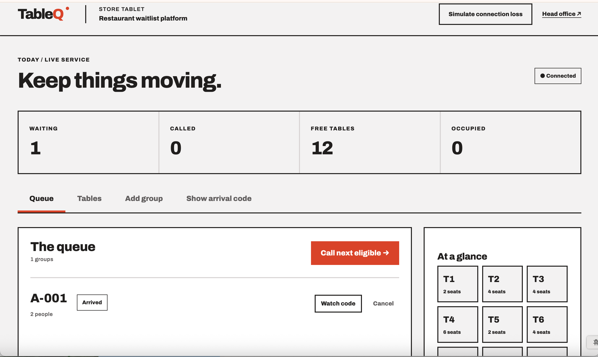

# Table Q by Codex

Table Q models queue and table management for restaurants and cafés. Customers can join a queue before arriving, store staff can manage waiting groups and table status, and head office can see activity across multiple stores.

*The Codex-generated Table Q store tablet interface for managing waiting groups and viewing table availability.*

## Beyond Entity project

| Project | BE file | Viewer | Download |
| --- | --- | --- | --- |
| Table Q by Codex | `table_q_codex.bemdl` | [View Codex architecture](https://canvas.beyondentity.com/viewsample?sample_project_file_id=rXxLCaaJ1nEVN9CKbneL) | [Download BE file](https://control.beyondentity.com/api/sample_project/rXxLCaaJ1nEVN9CKbneL/download) |

The `.bemdl` files are Beyond Entity projects. Use the viewers to explore them, or open a downloaded copy in the desktop app. The descriptions and links above come from the [official sample catalog](https://beyondentity.com/en/sample-projects); inspect the current project through MCP to establish its detailed models and implementation status.

## Codex-generated source

The Codex-generated implementation is included in [src/](src/). It contains a React/TypeScript client, Fastify API, PostgreSQL-backed queue, and a separate Node worker. The companion [db/](db/) directory is included because the initial migration and schema manifest are referenced by the implementation and tests.

This is a source snapshot. The original [implementation notes](src/README.md) and [test evidence](src/docs/implementation_and_test_evidence.md) describe the author's development environment and previous verification; those results have not been rerun as part of copying this sample. Personal filesystem paths in those historical documents refer to the original checkout, not a required installation location.

### Run in your own environment

Use Node.js 24.4 or later and a PostgreSQL instance with a dedicated database named `table_q_by_code`. Run application commands from `samples/table-q/src` in this repository.

1. Install dependencies with `npm ci`.
2. Copy `.env.example` to a private `.env` and configure your database URL, two independent cryptographic keys, and seed credentials. The example values must be replaced. Keep `.env` out of version control.
3. For a new, empty sample database, apply `../db/migrations/0001_beyond_entity_schema.sql`, then `db/migrations/0002_device_fault_transition_identity.sql`, using your PostgreSQL client. Do not reapply the initial migration to an existing installation; startup does not run migrations automatically.
4. Run `npm run seed`, then `npm run dev`.
5. Open the web application at `http://localhost:5174`. The API health endpoint is `http://127.0.0.1:3100/api/health`. Keep the browser origin consistent with `APP_ORIGIN` in `.env`.

The existing `npm run setup` helper has a macOS-specific Docker path when `PGPASSWORD` is not set. Manual `.env` configuration above avoids depending on that path. This source snapshot has not been validated on Windows.

For a built application, run `npm run build` and `npm start`, with `npm run worker` in a second terminal. Use the matching browser origin and `APP_ORIGIN` for port 3100. See the implementation notes for offline behavior, device enrollment, and simulator limitations.

The source provides `npm test`, `npm run build`, and `npm run test:browser`. Integration tests need the configured sample database; browser tests need the development server and installed Chrome. These commands are supplied by the source project, not evidence of a new successful test run here.

## Explore with an agent

After [connecting Beyond Entity to Codex](../../INSTALL.md), open the Table Q by Codex project and ask:

> Read this project's latest checkpoint and architecture documents. Explain the queue workflow and identify its relevant processors and transformations.

Compare the included implementation with the corresponding processor designs before changing it.
